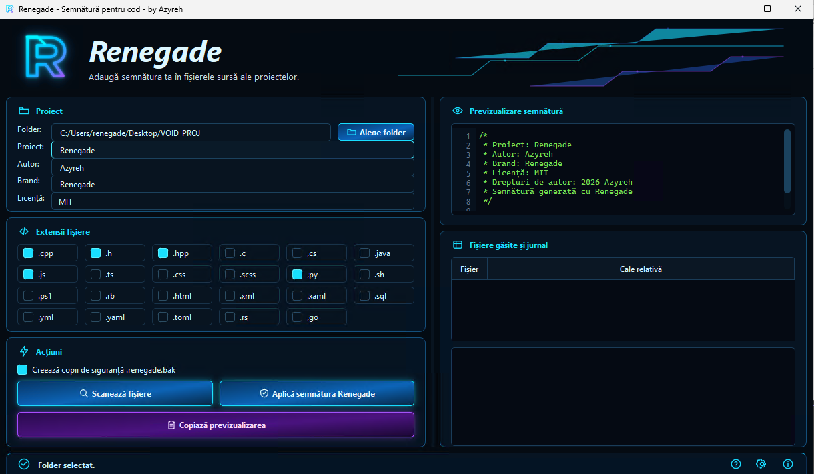

# Renegade

**Renegade** is a modern Qt/C++ desktop application for adding branded signature headers to source code files.

It helps developers quickly stamp project metadata such as project name, author, brand, license, copyright year, and a generated Renegade signature across multiple files.

The application is built with a dark cyber-style interface and focuses on being simple, fast, and safe to use on real projects.

---

## Preview



---

## Features

- Modern desktop GUI built with **Qt 6 Widgets**
- Dark cyber-style interface with custom styling
- Branded Renegade header with logo, glow effects, and circuit-style banner
- Select a project folder and scan files recursively
- Filter files by extension before applying signatures
- Live signature preview with code-style formatting
- Copy generated preview to clipboard
- Apply signatures to multiple source files at once
- Skip files that are already stamped
- Optional `.renegade.bak` backup creation before modifying files
- Preserves Python shebang and encoding lines
- Activity log with timestamps
- File results table with filename and relative path
- Status strip for clear user feedback
- Confirmation dialog before modifying files
- Embedded SVG icons and application resources
- CMake build system
- Windows executable icon support
- Automatic Qt deployment using `windeployqt`

---

## Supported File Types

Renegade supports smart comment generation for many common source and config files.

### C and C++

```text
.cpp
.c
.h
.hpp
```

### C Sharp, Java, JavaScript and TypeScript

```text
.cs
.java
.js
.ts
```

### Web and Style Files

```text
.html
.xml
.xaml
.css
.scss
.svg
```

### Python and Scripting

```text
.py
.sh
.ps1
.rb
```

### Config and Data

```text
.yml
.yaml
.toml
.sql
```

### Systems Languages

```text
.rs
.go
```

---

## Signature Templates

Renegade automatically chooses the correct comment style depending on the file type.

### C, C++, C Sharp, Java, JavaScript, TypeScript, CSS, Rust and Go

```cpp
/*
 * Project: Renegade
 * Author: Azyreh
 * Brand: Renegade
 * License: MIT
 * Copyright: 2026 Azyreh
 * Signature generated with Renegade
 */
```

### Python, Shell, PowerShell, Ruby, YAML and TOML

```py
# Project: Renegade
# Author: Azyreh
# Brand: Renegade
# License: MIT
# Copyright: 2026 Azyreh
# Signature generated with Renegade
```

### HTML, XML, XAML and SVG

```html
<!--
  Project: Renegade
  Author: Azyreh
  Brand: Renegade
  License: MIT
  Copyright: 2026 Azyreh
  Signature generated with Renegade
-->
```

### SQL

```sql
--
-- Project: Renegade
-- Author: Azyreh
-- Brand: Renegade
-- License: MIT
-- Copyright: 2026 Azyreh
-- Signature generated with Renegade
--
```

---

## Project Structure

```text
Renegade/
├── CMakeLists.txt
├── resources.qrc
├── appicon.rc
├── include/
│   ├── MainWindow.hpp
│   ├── FileScanner.hpp
│   ├── RenegadeTemplate.hpp
│   ├── Engine.hpp
│   └── Style.hpp
├── src/
│   ├── main.cpp
│   ├── MainWindow.cpp
│   ├── FileScanner.cpp
│   ├── RenegadeTemplate.cpp
│   ├── Engine.cpp
│   └── Style.cpp
└── resources/
    ├── icons/
    ├── logo.svg
    └── preview.png
```

---

## Technical Details

| Area | Details |
| --- | --- |
| Language | C++20 |
| Framework | Qt 6 Widgets |
| Build System | CMake |
| Main Platform | Windows |
| UI Style | Custom dark cyber-style Qt stylesheet |
| Deployment | `windeployqt` |

---

## Architecture

Renegade is separated into focused components.

| Component | Responsibility |
| --- | --- |
| `MainWindow` | Handles the GUI and user workflow |
| `FileScanner` | Recursively scans folders and filters files |
| `RenegadeTemplate` | Generates language-specific signature headers |
| `Engine` | Applies signatures and creates optional backups |
| `Style` | Defines the dark cyber-style application theme |

---

## Building from Source

### Requirements

- Windows
- CMake
- C++20 compatible compiler
- Qt 6
- Visual Studio 2022 or another supported C++ compiler

### Build Steps

```bash
git clone https://github.com/azyreh-dev/renegade-code-signature.git
cd Renegade
mkdir build
cd build
cmake ..
cmake --build . --config Release
```

The final executable will be generated inside the build output directory.

---

## Usage

1. Open Renegade.
2. Select the project folder you want to scan.
3. Fill in the project metadata:
   - Project name
   - Author
   - Brand
   - License
4. Select the file extensions you want to include.
5. Click **Scan Files**.
6. Review the discovered files.
7. Enable backups if needed.
8. Click **Apply Renegade Signature**.
9. Confirm the operation.

Renegade will apply the generated signature only to matching files and skip files that already contain a Renegade signature.

---

## Safety

Renegade is designed to avoid unnecessary damage to your project files.

It can:

- Create `.renegade.bak` backups before modifying files
- Skip files that are already stamped
- Show a confirmation dialog before applying changes
- Preserve important Python file headers such as shebang and encoding lines

Even with these protections, it is recommended to use Renegade on projects tracked with Git or another version control system.

---

## License Options Inside the App

Renegade includes the following license choices inside the user interface:

- MIT
- Apache 2.0
- GPLv3
- BSD 3-Clause
- Proprietary

---

## Roadmap

Possible future improvements:

- Drag and drop folder support
- Custom signature templates
- Ignore rules using `.gitignore`
- Dry-run mode
- Export scan results
- More file type support
- Linux and macOS packaging
- Installer for Windows
- Project preset profiles

---

## Author

Created by **Azyreh**

Renegade is built as a developer tool for quickly branding and organizing source code files with clean project signatures.

---

## License

This project is licensed under the MIT License.

See the [LICENSE](LICENSE) file for details.
